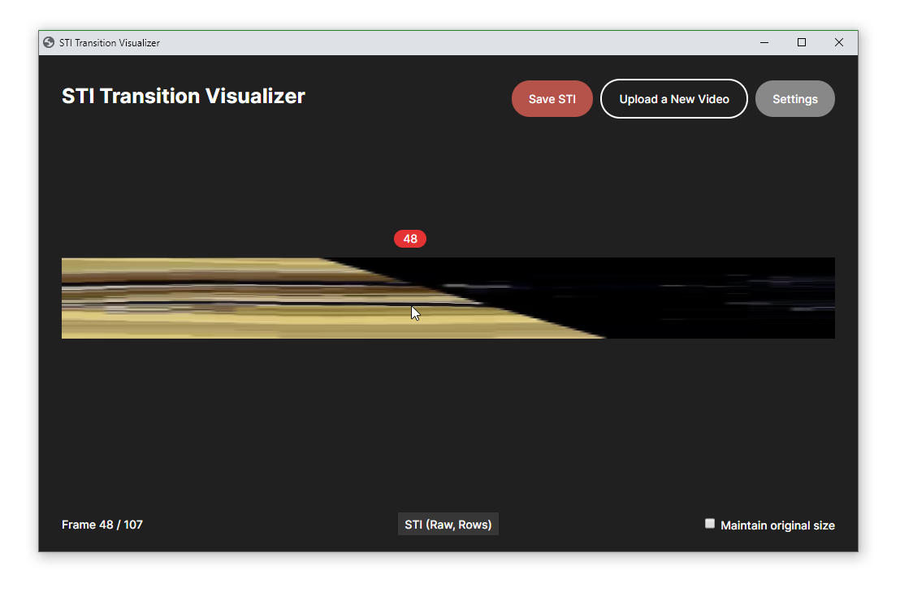

# STI video visualizer
A program that visualizes video transitions using frames from a clip to generate Spatio-Temporal Images (STI).



## Installation & Setup
**Python (3.7.X) dependencies required:**
- OpenCV
- Tkinter
- NumPy
- Eel
- PyInstaller (for building)

---

**Setting up**
```bash
npm install
```

**Running for development**
```bash
-- For renderer
npm run dev

-- For processor
npm run dev:py
```

**Build executable**
```bash
npm run build
```
